# Проверка производительности индекса

## Инструмент тестирования
- Apache JMeter

### 1. До применения индекса
1 одновременный запрос, 5 раз
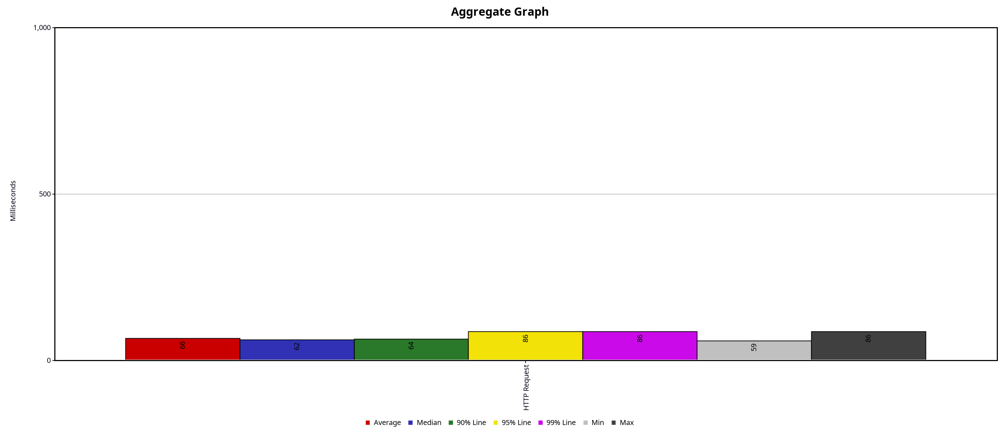
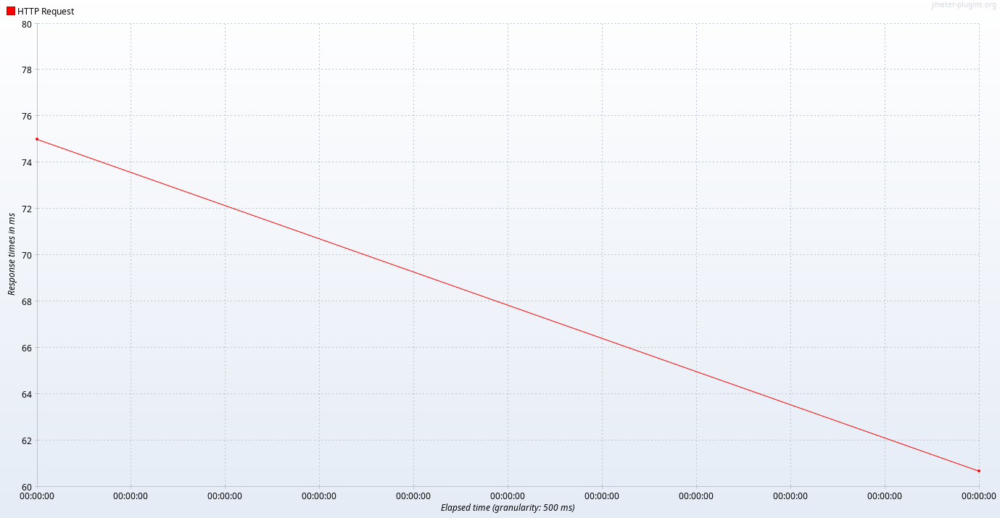
10 одновременных запросов, 5 раз
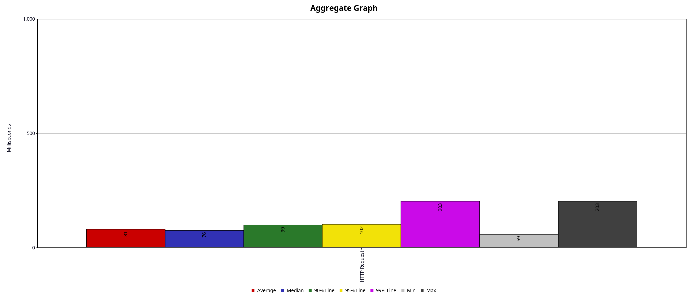
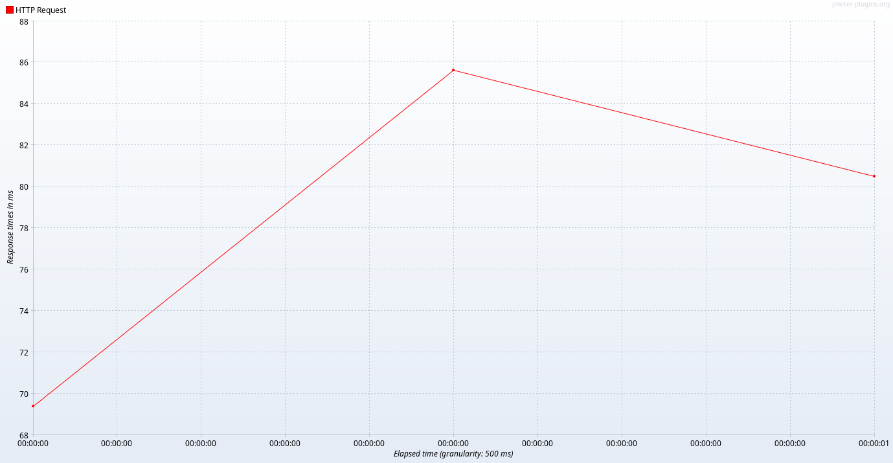
100 одновременных запросов, 5 раз
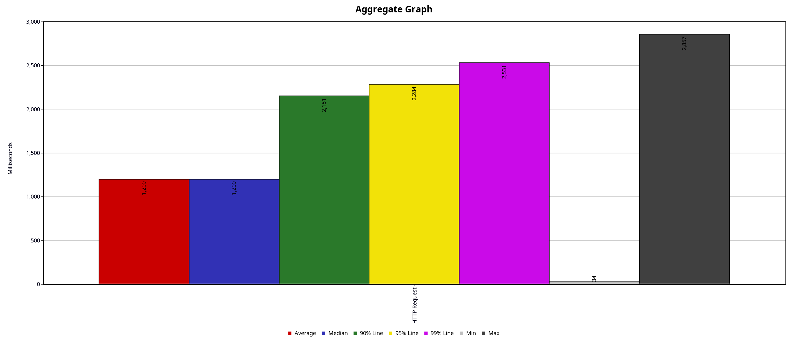
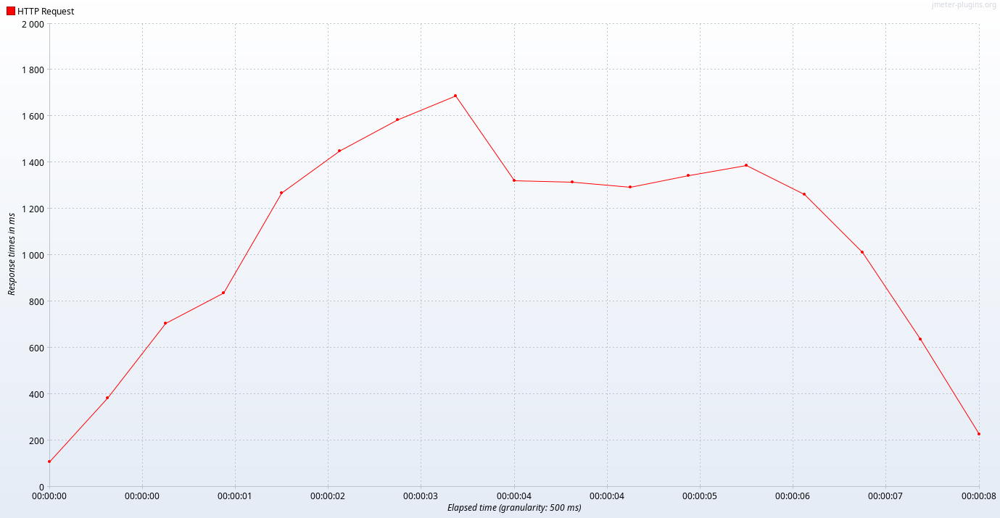
1000 одновременных запросов, 5 раз
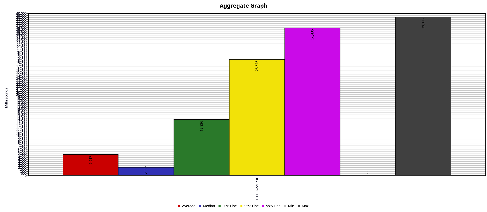
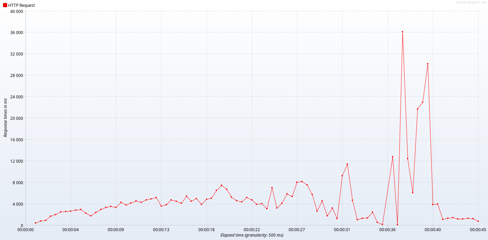

### 2. Строим индекс
Протестируем запрос до и после индекса. `:first_name`, `:second_name` поставляются в SQL в виде `<real_first_name>%`
```postgresql
explain analyze
select
    u.id,
    u.first_name,
    u.second_name,
    u.birthdate,
    u.biography,
    u.city,
    u.gender
from public.users u
where first_name like :first_name and second_name like :second_name
order by id
;
```

Для построения индекса проведем исследование данных:
```postgresql
select *
from pg_stats
where tablename = 'users'
;
```
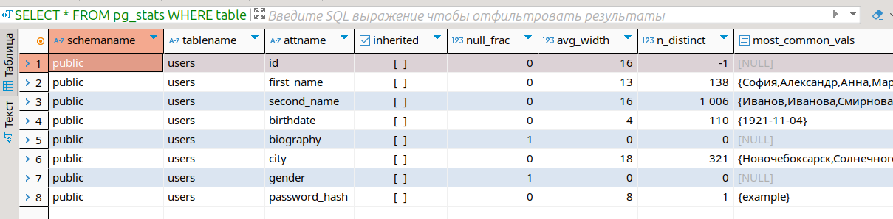
- Как видим, фамилии более вариабельны, чем имена. Поэтому построим двухколоночный индекс, где в первую очередь выбираются фамилии.

- Воспользуемся классом оператора `varchar_pattern_ops`, чтобы поддержать запросы вида `like` вместо посимвольного сравнения.

- Используем B-Tree индекс(по-умолчанию), т.к. такой тип индекса позволяет делать сравнения вида "больше-меньше", а не только на "равенство/неравенство".

- Для ускорения доступа к данным - сохраним дополнительные поля в индекс.

Дополнительно:
- Может возникнуть случай, что в `/search` попадет запрос без фамилии. В такой ситуации многоколоночный индекс, начинающийся с фамилии не будет задействован. Поэтому добавим аналогичный индекс только по имени.

Создаем индексы:
```postgresql
create index if not exists second_first_name_btree_idx
on public.users
    (second_name varchar_pattern_ops, first_name varchar_pattern_ops)
include
    (id, birthdate, biography, city, gender)
;

create index if not exists first_name_btree_idx
    on public.users
        (first_name varchar_pattern_ops)
include
        (id, birthdate, biography, city, gender)
;
```

Результаты `explain` до индекса:
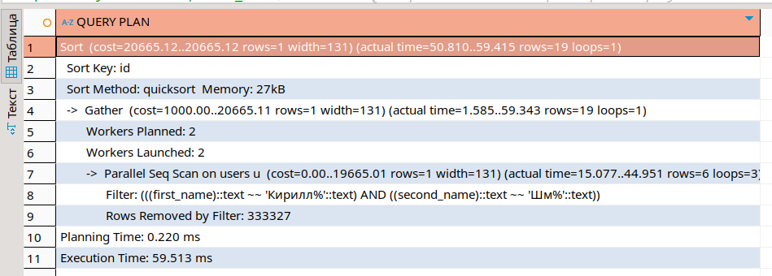

После:
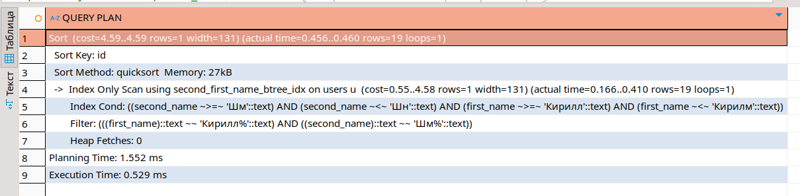

### 1. После применения индекса
1 одновременный запрос, 5 раз
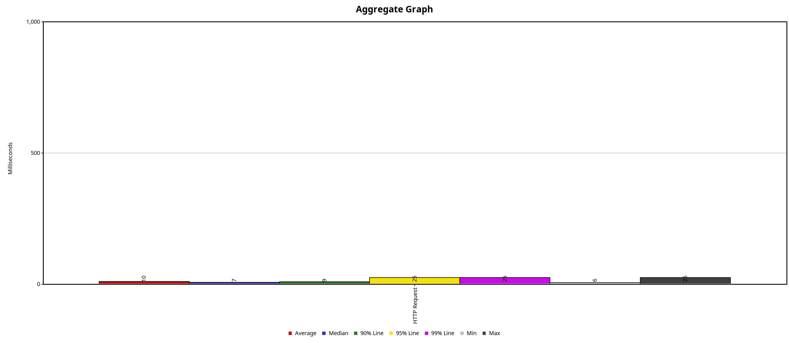
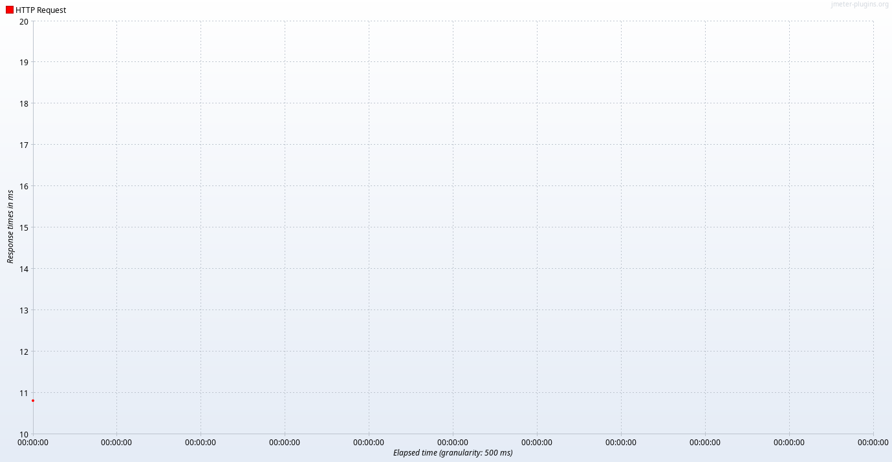
10 одновременных запросов, 5 раз
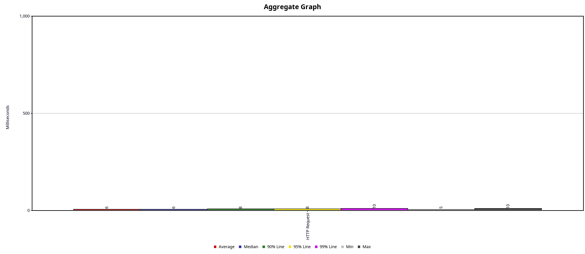
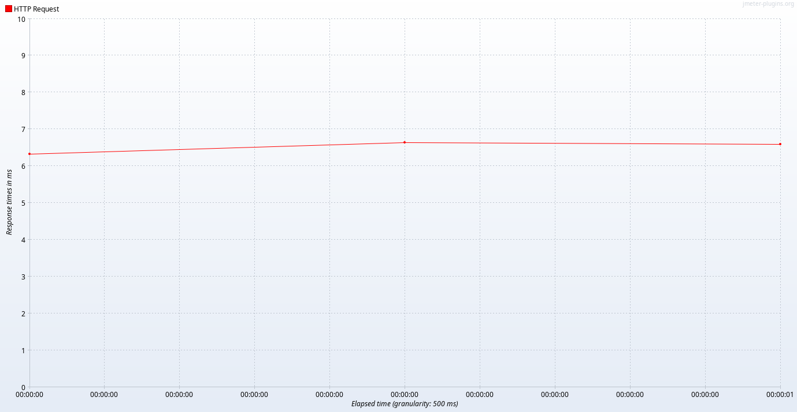
100 одновременных запросов, 5 раз
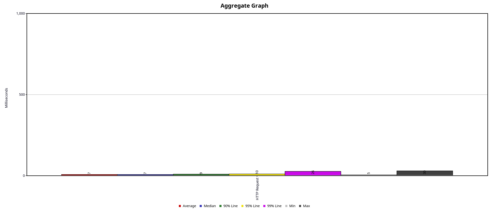
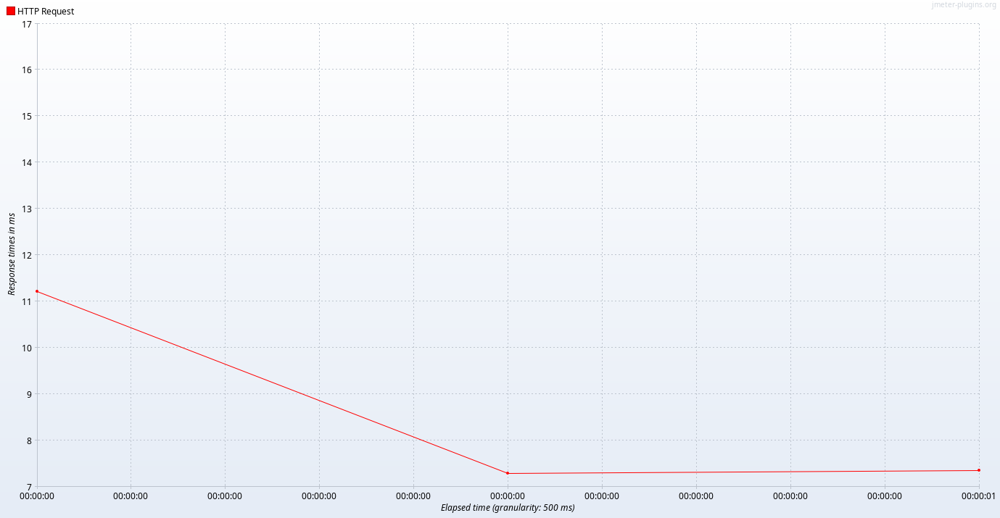
1000 одновременных запросов, 5 раз
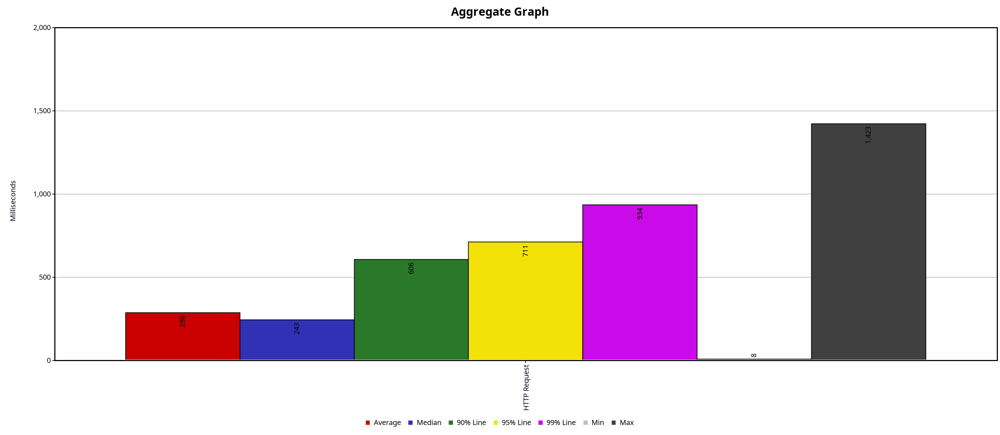
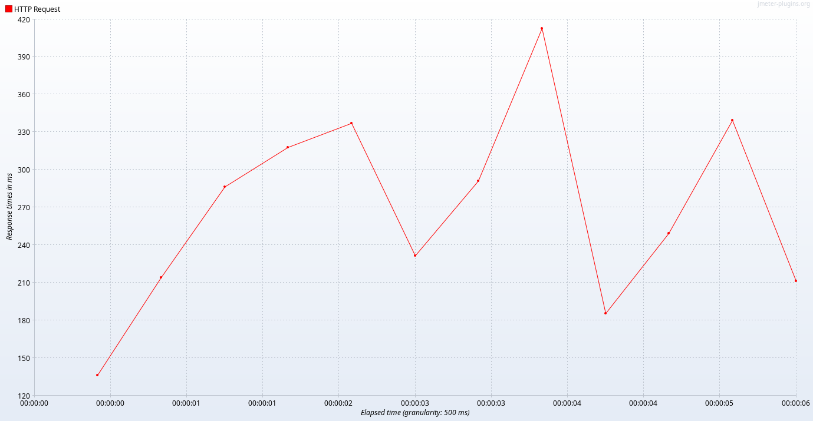