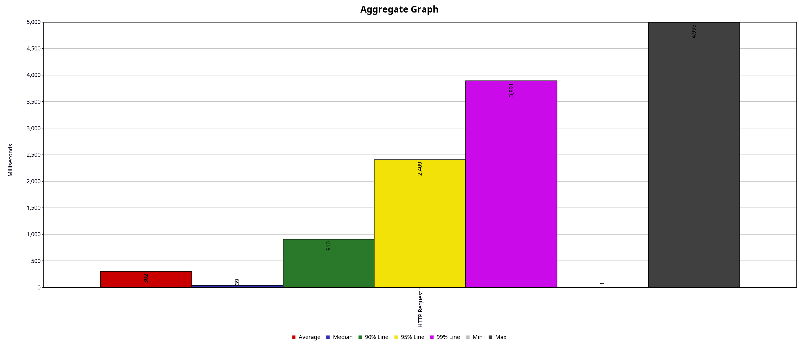
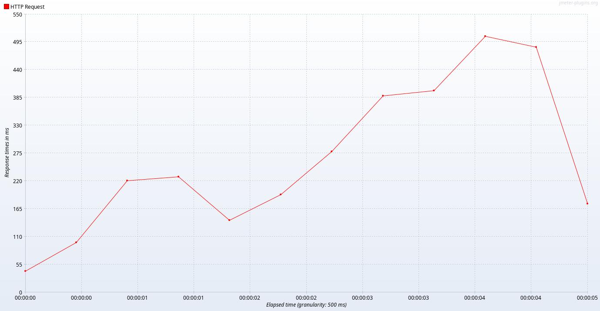
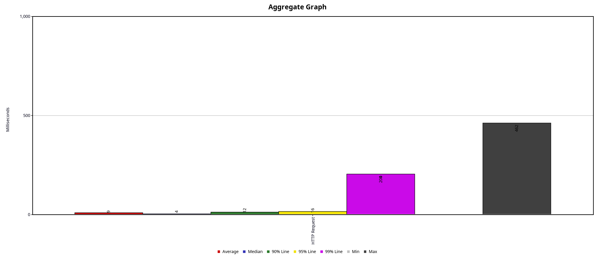
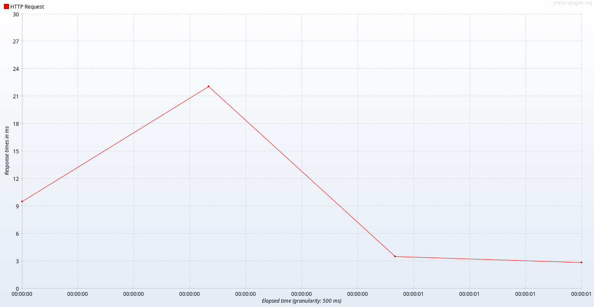
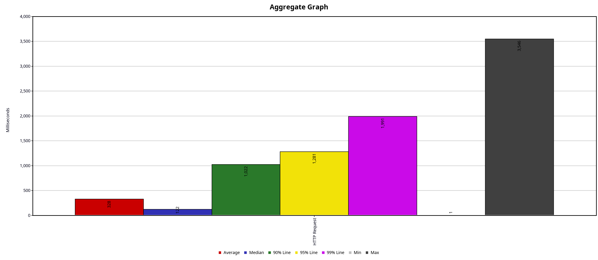
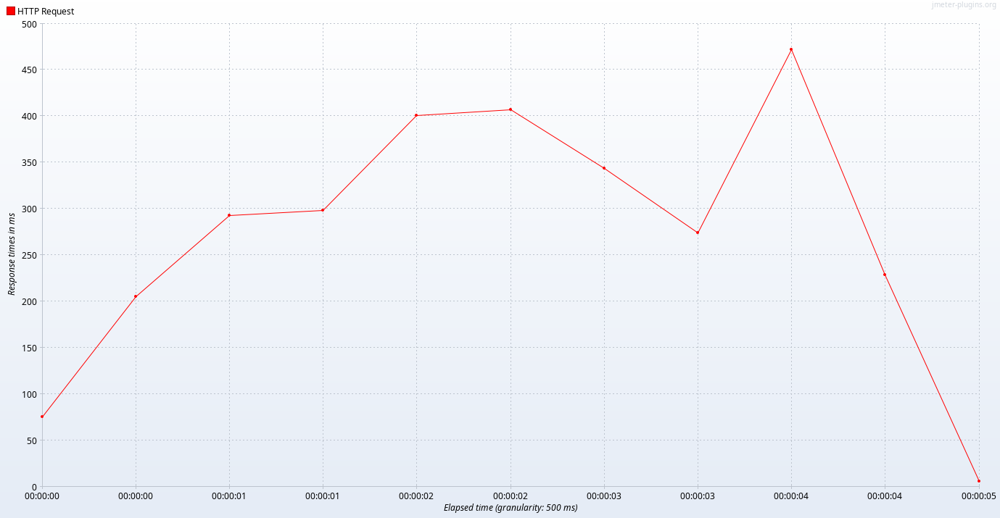
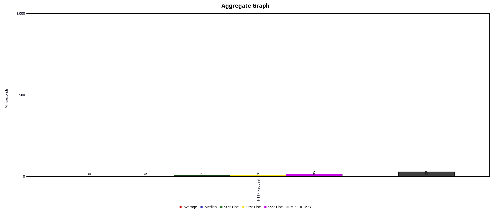
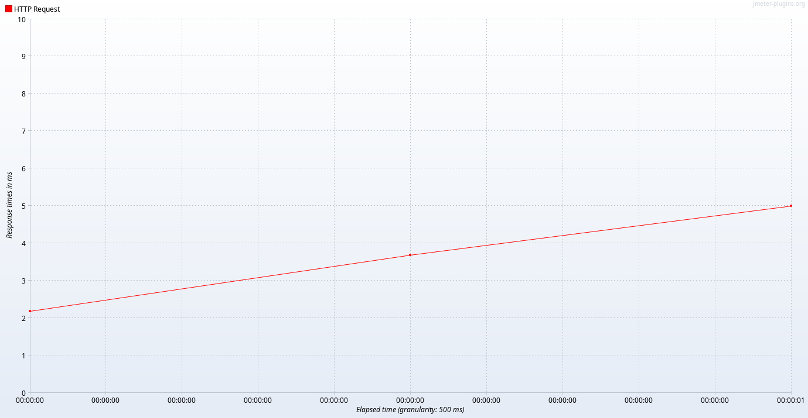

# Репликация


## Инструменты тестирования
- Apache JMeter
- `docker stats`

## A. Запросы на чтение
#### Данные
Данные для нагрузки лежат в `/db/migrations/data/mytest_get_data.csv` и `/db/migrations/mytest_search_data.csv` для запросов `/user/search` и `/user/get` соответственно.
#### Нагрузка
1000 пользователей, 10 циклов с перерывом в 1 секунду.

### 1. До репликации(только master)
1. Запрос `/user/search`
Загрузка CPU/памяти:
```
CONTAINER ID   NAME               CPU %     MEM USAGE / LIMIT     MEM %     NET I/O           BLOCK I/O        PIDS
3e9a1238b930   go_courses-app-1   0.00%     9.438MiB / 15.03GiB   0.06%     15.5MB / 24.8MB   0B / 0B          20
903b22836bb2   db                 0.00%     27.41MiB / 15.03GiB   0.18%     2.71MB / 19.7MB   18.6MB / 762kB   6
CONTAINER ID   NAME               CPU %     MEM USAGE / LIMIT     MEM %     NET I/O           BLOCK I/O        PIDS
3e9a1238b930   go_courses-app-1   188.45%   9.828MiB / 15.03GiB   0.06%     28.6MB / 45.5MB   0B / 0B          20
903b22836bb2   db                 211.88%   42.8MiB / 15.03GiB    0.28%     3MB / 32.3MB      18.6MB / 762kB   14
CONTAINER ID   NAME               CPU %     MEM USAGE / LIMIT     MEM %     NET I/O           BLOCK I/O        PIDS
3e9a1238b930   go_courses-app-1   188.45%   9.828MiB / 15.03GiB   0.06%     28.6MB / 45.5MB   0B / 0B          20
903b22836bb2   db                 211.88%   42.8MiB / 15.03GiB    0.28%     3MB / 32.3MB      18.6MB / 762kB   14
CONTAINER ID   NAME               CPU %     MEM USAGE / LIMIT     MEM %     NET I/O           BLOCK I/O        PIDS
3e9a1238b930   go_courses-app-1   33.93%    9.883MiB / 15.03GiB   0.06%     31MB / 49.5MB     0B / 0B          20
903b22836bb2   db                 37.04%    42.16MiB / 15.03GiB   0.27%     3.05MB / 34.7MB   18.6MB / 762kB   14
CONTAINER ID   NAME               CPU %     MEM USAGE / LIMIT     MEM %     NET I/O           BLOCK I/O        PIDS
3e9a1238b930   go_courses-app-1   33.93%    9.883MiB / 15.03GiB   0.06%     31MB / 49.5MB     0B / 0B          20
903b22836bb2   db                 37.04%    42.16MiB / 15.03GiB   0.27%     3.05MB / 34.7MB   18.6MB / 762kB   14
CONTAINER ID   NAME               CPU %     MEM USAGE / LIMIT     MEM %     NET I/O           BLOCK I/O        PIDS
3e9a1238b930   go_courses-app-1   0.00%     9.883MiB / 15.03GiB   0.06%     31MB / 49.5MB     0B / 0B          20
903b22836bb2   db                 0.00%     42.14MiB / 15.03GiB   0.27%     3.05MB / 34.7MB   18.6MB / 762kB   14
```
Графики Jmeter:



2. Запрос `/user/get`
Загрузка CPU/памяти:
```
CONTAINER ID   NAME               CPU %     MEM USAGE / LIMIT     MEM %     NET I/O          BLOCK I/O        PIDS
3e9a1238b930   go_courses-app-1   0.00%     31.05MiB / 15.03GiB   0.20%     179MB / 278MB    0B / 0B          31
903b22836bb2   db                 0.00%     27.41MiB / 15.03GiB   0.18%     9.46MB / 175MB   18.6MB / 762kB   6
CONTAINER ID   NAME               CPU %     MEM USAGE / LIMIT     MEM %     NET I/O         BLOCK I/O        PIDS
3e9a1238b930   go_courses-app-1   301.02%   32.98MiB / 15.03GiB   0.21%     183MB / 283MB   0B / 0B          31
903b22836bb2   db                 381.69%   194.2MiB / 15.03GiB   1.26%     11MB / 178MB    18.6MB / 762kB   106
CONTAINER ID   NAME               CPU %     MEM USAGE / LIMIT     MEM %     NET I/O         BLOCK I/O        PIDS
3e9a1238b930   go_courses-app-1   301.02%   32.98MiB / 15.03GiB   0.21%     183MB / 283MB   0B / 0B          31
903b22836bb2   db                 381.69%   194.2MiB / 15.03GiB   1.26%     11MB / 178MB    18.6MB / 762kB   106
CONTAINER ID   NAME               CPU %     MEM USAGE / LIMIT     MEM %     NET I/O          BLOCK I/O        PIDS
3e9a1238b930   go_courses-app-1   123.85%   32.79MiB / 15.03GiB   0.21%     186MB / 285MB    0B / 0B          31
903b22836bb2   db                 70.67%    194MiB / 15.03GiB     1.26%     11.8MB / 180MB   18.6MB / 762kB   106
CONTAINER ID   NAME               CPU %     MEM USAGE / LIMIT     MEM %     NET I/O          BLOCK I/O        PIDS
3e9a1238b930   go_courses-app-1   123.85%   32.79MiB / 15.03GiB   0.21%     186MB / 285MB    0B / 0B          31
903b22836bb2   db                 70.67%    194MiB / 15.03GiB     1.26%     11.8MB / 180MB   18.6MB / 762kB   106
CONTAINER ID   NAME               CPU %     MEM USAGE / LIMIT     MEM %     NET I/O          BLOCK I/O        PIDS
3e9a1238b930   go_courses-app-1   0.00%     32.79MiB / 15.03GiB   0.21%     186MB / 285MB    0B / 0B          31
903b22836bb2   db                 0.00%     194MiB / 15.03GiB     1.26%     11.8MB / 180MB   18.6MB / 762kB   106
```
Графики Jmeter:



### 2. 1 master, 2 slave
Настроили 2 асинхронные реплики.

1. Запрос `/user/search`
Загрузка CPU/памяти:
```
CONTAINER ID   NAME               CPU %     MEM USAGE / LIMIT     MEM %     NET I/O           BLOCK I/O         PIDS
872303507b7b   go_courses-app-1   0.00%     4.84MiB / 15.03GiB    0.03%     7.18kB / 2.52kB   0B / 0B           10
44837c1c46ed   db_slave1          0.13%     34.2MiB / 15.03GiB    0.22%     5.3MB / 191MB     46.9MB / 2.65MB   12
86ee9683b27b   db                 0.00%     53.14MiB / 15.03GiB   0.35%     11.5MB / 335MB    56.7MB / 799kB    20
54534f4f24ed   db_slave2          0.13%     26.02MiB / 15.03GiB   0.17%     5.49MB / 174MB    29.7MB / 356kB    6
CONTAINER ID   NAME               CPU %     MEM USAGE / LIMIT     MEM %     NET I/O           BLOCK I/O         PIDS
872303507b7b   go_courses-app-1   6.56%     8.719MiB / 15.03GiB   0.06%     86.7kB / 37.4kB   0B / 0B           20
44837c1c46ed   db_slave1          10.54%    51.18MiB / 15.03GiB   0.33%     5.31MB / 191MB    46.9MB / 2.65MB   24
86ee9683b27b   db                 0.00%     53.14MiB / 15.03GiB   0.35%     11.5MB / 335MB    56.7MB / 799kB    20
54534f4f24ed   db_slave2          0.49%     26.38MiB / 15.03GiB   0.17%     5.49MB / 174MB    29.7MB / 356kB    6
CONTAINER ID   NAME               CPU %     MEM USAGE / LIMIT     MEM %     NET I/O           BLOCK I/O         PIDS
872303507b7b   go_courses-app-1   6.56%     8.719MiB / 15.03GiB   0.06%     86.7kB / 37.4kB   0B / 0B           20
44837c1c46ed   db_slave1          10.54%    51.18MiB / 15.03GiB   0.33%     5.31MB / 191MB    46.9MB / 2.65MB   24
86ee9683b27b   db                 0.00%     53.14MiB / 15.03GiB   0.35%     11.5MB / 335MB    56.7MB / 799kB    20
54534f4f24ed   db_slave2          0.49%     26.38MiB / 15.03GiB   0.17%     5.49MB / 174MB    29.7MB / 356kB    6
CONTAINER ID   NAME               CPU %     MEM USAGE / LIMIT     MEM %     NET I/O           BLOCK I/O         PIDS
872303507b7b   go_courses-app-1   326.89%   89.97MiB / 15.03GiB   0.58%     18.6MB / 22.4MB   0B / 0B           30
44837c1c46ed   db_slave1          426.07%   210.2MiB / 15.03GiB   1.37%     5.72MB / 202MB    46.9MB / 2.65MB   111
86ee9683b27b   db                 0.00%     53.14MiB / 15.03GiB   0.35%     11.5MB / 335MB    56.7MB / 799kB    20
54534f4f24ed   db_slave2          351.65%   204.4MiB / 15.03GiB   1.33%     5.83MB / 180MB    29.7MB / 356kB    118
CONTAINER ID   NAME               CPU %     MEM USAGE / LIMIT     MEM %     NET I/O           BLOCK I/O         PIDS
872303507b7b   go_courses-app-1   326.89%   89.97MiB / 15.03GiB   0.58%     18.6MB / 22.4MB   0B / 0B           30
44837c1c46ed   db_slave1          426.07%   210.2MiB / 15.03GiB   1.37%     5.72MB / 202MB    46.9MB / 2.65MB   111
86ee9683b27b   db                 0.00%     53.14MiB / 15.03GiB   0.35%     11.5MB / 335MB    56.7MB / 799kB    20
54534f4f24ed   db_slave2          351.65%   204.4MiB / 15.03GiB   1.33%     5.83MB / 180MB    29.7MB / 356kB    118
CONTAINER ID   NAME               CPU %     MEM USAGE / LIMIT     MEM %     NET I/O           BLOCK I/O         PIDS
872303507b7b   go_courses-app-1   396.55%   149.3MiB / 15.03GiB   0.97%     47.3MB / 70.6MB   0B / 0B           31
44837c1c46ed   db_slave1          402.72%   211.8MiB / 15.03GiB   1.38%     6.18MB / 221MB    46.9MB / 2.65MB   110
86ee9683b27b   db                 0.00%     53.14MiB / 15.03GiB   0.35%     11.5MB / 335MB    56.7MB / 799kB    20
54534f4f24ed   db_slave2          383.97%   205.3MiB / 15.03GiB   1.33%     6.31MB / 188MB    29.7MB / 356kB    112
CONTAINER ID   NAME               CPU %     MEM USAGE / LIMIT     MEM %     NET I/O           BLOCK I/O         PIDS
872303507b7b   go_courses-app-1   396.55%   149.3MiB / 15.03GiB   0.97%     47.3MB / 70.6MB   0B / 0B           31
44837c1c46ed   db_slave1          402.72%   211.8MiB / 15.03GiB   1.38%     6.18MB / 221MB    46.9MB / 2.65MB   110
86ee9683b27b   db                 0.00%     53.14MiB / 15.03GiB   0.35%     11.5MB / 335MB    56.7MB / 799kB    20
54534f4f24ed   db_slave2          383.97%   205.3MiB / 15.03GiB   1.33%     6.31MB / 188MB    29.7MB / 356kB    112
CONTAINER ID   NAME               CPU %     MEM USAGE / LIMIT     MEM %     NET I/O          BLOCK I/O         PIDS
872303507b7b   go_courses-app-1   319.89%   135.1MiB / 15.03GiB   0.88%     74.7MB / 109MB   0B / 0B           33
44837c1c46ed   db_slave1          339.65%   212.6MiB / 15.03GiB   1.38%     6.54MB / 235MB   46.9MB / 2.65MB   119
86ee9683b27b   db                 0.64%     53.14MiB / 15.03GiB   0.35%     11.5MB / 335MB   56.7MB / 799kB    20
54534f4f24ed   db_slave2          468.16%   209.5MiB / 15.03GiB   1.36%     6.79MB / 202MB   29.7MB / 356kB    121
CONTAINER ID   NAME               CPU %     MEM USAGE / LIMIT     MEM %     NET I/O          BLOCK I/O         PIDS
872303507b7b   go_courses-app-1   319.89%   135.1MiB / 15.03GiB   0.88%     74.7MB / 109MB   0B / 0B           33
44837c1c46ed   db_slave1          339.65%   212.6MiB / 15.03GiB   1.38%     6.54MB / 235MB   46.9MB / 2.65MB   119
86ee9683b27b   db                 0.64%     53.14MiB / 15.03GiB   0.35%     11.5MB / 335MB   56.7MB / 799kB    20
54534f4f24ed   db_slave2          468.16%   209.5MiB / 15.03GiB   1.36%     6.79MB / 202MB   29.7MB / 356kB    121
CONTAINER ID   NAME               CPU %     MEM USAGE / LIMIT     MEM %     NET I/O          BLOCK I/O         PIDS
872303507b7b   go_courses-app-1   326.62%   176.1MiB / 15.03GiB   1.14%     103MB / 156MB    0B / 0B           33
44837c1c46ed   db_slave1          302.81%   211.1MiB / 15.03GiB   1.37%     6.88MB / 249MB   46.9MB / 2.65MB   110
86ee9683b27b   db                 0.02%     53.14MiB / 15.03GiB   0.35%     11.5MB / 335MB   56.7MB / 799kB    20
54534f4f24ed   db_slave2          372.89%   222.7MiB / 15.03GiB   1.45%     7.17MB / 215MB   29.7MB / 356kB    165
CONTAINER ID   NAME               CPU %     MEM USAGE / LIMIT     MEM %     NET I/O          BLOCK I/O         PIDS
872303507b7b   go_courses-app-1   326.62%   176.1MiB / 15.03GiB   1.14%     103MB / 156MB    0B / 0B           33
44837c1c46ed   db_slave1          302.81%   211.1MiB / 15.03GiB   1.37%     6.88MB / 249MB   46.9MB / 2.65MB   110
86ee9683b27b   db                 0.02%     53.14MiB / 15.03GiB   0.35%     11.5MB / 335MB   56.7MB / 799kB    20
54534f4f24ed   db_slave2          372.89%   222.7MiB / 15.03GiB   1.45%     7.17MB / 215MB   29.7MB / 356kB    165
CONTAINER ID   NAME               CPU %     MEM USAGE / LIMIT     MEM %     NET I/O          BLOCK I/O         PIDS
872303507b7b   go_courses-app-1   264.25%   61.01MiB / 15.03GiB   0.40%     126MB / 200MB    0B / 0B           33
44837c1c46ed   db_slave1          198.37%   211.1MiB / 15.03GiB   1.37%     7.12MB / 260MB   46.9MB / 2.65MB   110
86ee9683b27b   db                 0.00%     53.14MiB / 15.03GiB   0.35%     11.5MB / 335MB   56.7MB / 799kB    20
54534f4f24ed   db_slave2          245.26%   203.9MiB / 15.03GiB   1.32%     7.43MB / 226MB   29.7MB / 356kB    105
CONTAINER ID   NAME               CPU %     MEM USAGE / LIMIT     MEM %     NET I/O          BLOCK I/O         PIDS
872303507b7b   go_courses-app-1   264.25%   61.01MiB / 15.03GiB   0.40%     126MB / 200MB    0B / 0B           33
44837c1c46ed   db_slave1          198.37%   211.1MiB / 15.03GiB   1.37%     7.12MB / 260MB   46.9MB / 2.65MB   110
86ee9683b27b   db                 0.00%     53.14MiB / 15.03GiB   0.35%     11.5MB / 335MB   56.7MB / 799kB    20
54534f4f24ed   db_slave2          245.26%   203.9MiB / 15.03GiB   1.32%     7.43MB / 226MB   29.7MB / 356kB    105
CONTAINER ID   NAME               CPU %     MEM USAGE / LIMIT     MEM %     NET I/O          BLOCK I/O         PIDS
872303507b7b   go_courses-app-1   0.01%     61MiB / 15.03GiB      0.40%     126MB / 200MB    0B / 0B           33
44837c1c46ed   db_slave1          0.07%     211.1MiB / 15.03GiB   1.37%     7.12MB / 260MB   46.9MB / 2.65MB   110
86ee9683b27b   db                 0.00%     53.14MiB / 15.03GiB   0.35%     11.5MB / 335MB   56.7MB / 799kB    20
54534f4f24ed   db_slave2          0.07%     203.9MiB / 15.03GiB   1.32%     7.43MB / 226MB   29.7MB / 356kB    105
```

Графики Jmeter:




2. Запрос `/user/get`
Загрузка CPU/памяти:
```
CONTAINER ID   NAME               CPU %     MEM USAGE / LIMIT     MEM %     NET I/O          BLOCK I/O         PIDS
872303507b7b   go_courses-app-1   0.00%     36.3MiB / 15.03GiB    0.24%     133MB / 206MB    0B / 0B           33
44837c1c46ed   db_slave1          0.12%     86.54MiB / 15.03GiB   0.56%     8.31MB / 262MB   47.9MB / 2.65MB   43
86ee9683b27b   db                 0.00%     51.72MiB / 15.03GiB   0.34%     11.6MB / 335MB   56.7MB / 799kB    19
54534f4f24ed   db_slave2          0.15%     99.85MiB / 15.03GiB   0.65%     8.64MB / 229MB   30.8MB / 356kB    50
CONTAINER ID   NAME               CPU %     MEM USAGE / LIMIT     MEM %     NET I/O          BLOCK I/O         PIDS
872303507b7b   go_courses-app-1   320.83%   35.61MiB / 15.03GiB   0.23%     139MB / 211MB    0B / 0B           33
44837c1c46ed   db_slave1          88.91%    86.86MiB / 15.03GiB   0.56%     9.24MB / 264MB   47.9MB / 2.65MB   43
86ee9683b27b   db                 0.00%     51.72MiB / 15.03GiB   0.34%     11.6MB / 335MB   56.7MB / 799kB    19
54534f4f24ed   db_slave2          91.46%    100.7MiB / 15.03GiB   0.65%     9.57MB / 231MB   30.8MB / 356kB    50
CONTAINER ID   NAME               CPU %     MEM USAGE / LIMIT     MEM %     NET I/O          BLOCK I/O         PIDS
872303507b7b   go_courses-app-1   320.83%   35.61MiB / 15.03GiB   0.23%     139MB / 211MB    0B / 0B           33
44837c1c46ed   db_slave1          88.91%    86.86MiB / 15.03GiB   0.56%     9.24MB / 264MB   47.9MB / 2.65MB   43
86ee9683b27b   db                 0.00%     51.72MiB / 15.03GiB   0.34%     11.6MB / 335MB   56.7MB / 799kB    19
54534f4f24ed   db_slave2          91.46%    100.7MiB / 15.03GiB   0.65%     9.57MB / 231MB   30.8MB / 356kB    50
CONTAINER ID   NAME               CPU %     MEM USAGE / LIMIT     MEM %     NET I/O          BLOCK I/O         PIDS
872303507b7b   go_courses-app-1   61.47%    35.85MiB / 15.03GiB   0.23%     141MB / 212MB    0B / 0B           33
44837c1c46ed   db_slave1          15.57%    86.54MiB / 15.03GiB   0.56%     9.39MB / 264MB   47.9MB / 2.65MB   43
86ee9683b27b   db                 0.00%     51.72MiB / 15.03GiB   0.34%     11.6MB / 335MB   56.7MB / 799kB    19
54534f4f24ed   db_slave2          17.39%    99.86MiB / 15.03GiB   0.65%     9.75MB / 231MB   30.8MB / 356kB    50
CONTAINER ID   NAME               CPU %     MEM USAGE / LIMIT     MEM %     NET I/O          BLOCK I/O         PIDS
872303507b7b   go_courses-app-1   61.47%    35.85MiB / 15.03GiB   0.23%     141MB / 212MB    0B / 0B           33
44837c1c46ed   db_slave1          15.57%    86.54MiB / 15.03GiB   0.56%     9.39MB / 264MB   47.9MB / 2.65MB   43
86ee9683b27b   db                 0.00%     51.72MiB / 15.03GiB   0.34%     11.6MB / 335MB   56.7MB / 799kB    19
54534f4f24ed   db_slave2          17.39%    99.86MiB / 15.03GiB   0.65%     9.75MB / 231MB   30.8MB / 356kB    50
CONTAINER ID   NAME               CPU %     MEM USAGE / LIMIT     MEM %     NET I/O          BLOCK I/O         PIDS
872303507b7b   go_courses-app-1   0.00%     35.85MiB / 15.03GiB   0.23%     141MB / 212MB    0B / 0B           33
44837c1c46ed   db_slave1          0.08%     86.54MiB / 15.03GiB   0.56%     9.39MB / 264MB   47.9MB / 2.65MB   43
86ee9683b27b   db                 0.01%     51.72MiB / 15.03GiB   0.34%     11.6MB / 335MB   56.7MB / 799kB    19
54534f4f24ed   db_slave2          0.09%     99.86MiB / 15.03GiB   0.65%     9.75MB / 231MB   30.8MB / 356kB    50
```
Графики Jmeter:



### 3. Выводы по нагрузке на чтение
- Нагрузка перешла с мастера на слейвы.
- Улучшились показатели throughput и latency для обоих запросов.

### 4. Кворумная репликация
Настраиваем кворумную репликацию на мастере
```
synchronous_commit = on
synchronous_standby_names = 'ANY 1 (pgslav1, pgslave2)'
```

- `db_slave1 = pgslave1`
- `db_slave2 = pgslave2`

Нагрузка на запись на ручку `/user/register`.

0. Изначальное число записей в таблице `public.users` - `1000003`.
1. Делаем нагрузку на запись на мастер.
2. Останавливаем `db_slave2`.
3. Останавливаем нагрузку.
4. Число записей на `db` = `1000203`.
4. Число записей на `db_slave1` = `1000203`.
4. Останавливаем мастер(`db`) и второй слейв(`db_slave1`).
5. Промоутим `db_slave1` до мастера, настраиваем `db_slave2` для переключения на новый мастер.
6. Число записей в таблице на `db_slave1`, `db_slave2` = `1000203`.

Итог: потерь транзакций не возникло.
